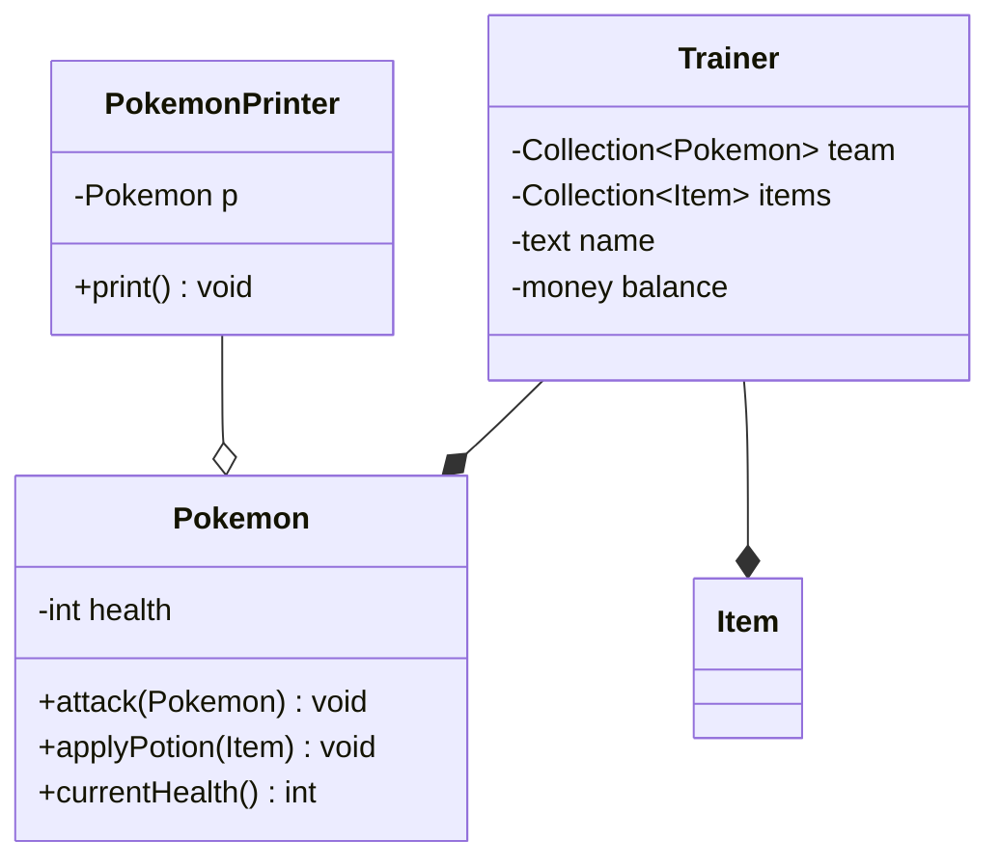

# 2450-&eacute;mon

This repository contains a domain model and an initial implementation of our
minimal Pok&eacute;mon game:

> A trainer who has Pokémon and items. Pokémon can battle by attacking one
> another to reduce health. Items can be applied to Pokémon to restore health.

## Domain model

Our domain model is a UML class diagram drawn using [Mermaid]. We can see our
diagram rendered in [the CS department's student GitLab] (you might be looking
at it right now!), but you can also see the output of this diagram in Visual
Studio Code using the [Markdown Preview Mermaid Support] extension. You may also
have an editor with built-in Mermaid support, and in that case you don't need to
install anything, just open the file!

### Getting the code

While this example looks great rendered on GitLab, it's also helpful to be able
to see the Mermaid code behind the diagram. You can see the Mermaid code in a
few different ways:

* Downloading the code, either:
    * [Click this
      link](https://code.cs.umanitoba.ca/comp2450-fall2025/2450-emon/-/raw/main/README.md?ref_type=heads&inline=false).
    * Click on the blue button above &uarr; labelled "Code" and choose `zip`.
* Viewing the file as a "raw" file:
    * Click on the name of the file in the table above (`README.md`)
    * Click on the "Code" button just above the file on the right side of the
      page, or click on the button on the right side of the page that looks like
      a page with the symbols `>_` (the alt text for this button is "Open raw"
      in English).
* [Cloning the Git repository].

[Cloning the Git repository]: https://toolsntechniques.ca/topic03/topic-3.html#cloning-a-repository

### Mermaid diagram

Here is our domain model with attributes and initial behaviours added:

[Mermaid]: https://mermaid.js.org/syntax/classDiagram.html
[Markdown Preview Mermaid Support]: https://marketplace.visualstudio.com/items?itemName=bierner.markdown-mermaid
[the CS department's student GitLab]: https://code.cs.umanitoba.ca

## Implementation

The repository now also contains an implementation of parts of this domain model
that have been prepared using [IntelliJ IDEA].

You can [clone this project from within IntelliJ] (this guide is for GitHub, but
the process is almost exactly the same), you can [clone this project separately
from IntelliJ] and import it, or you can manually copy/paste the files into your
own project.

[IntelliJ IDEA]: https://www.jetbrains.com/idea/
[clone this project from within IntelliJ]: https://blog.jetbrains.com/idea/2020/10/clone-a-project-from-github/
[clone this project separately from IntelliJ]: https://toolsntechniques.ca/topic03/topic-3.html#cloning-a-repository