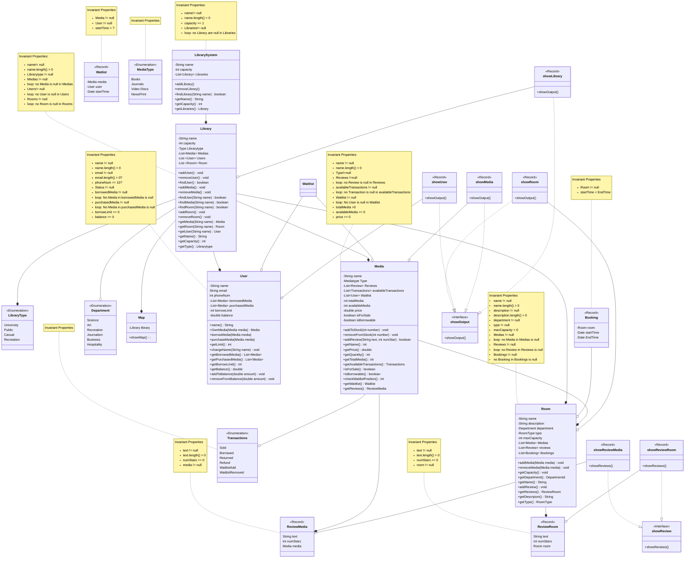

# Overview

Library Simulator is an implementation of a library System which consists of several libraries differentiated by their media but have the same core functionalities for their users:

- Each library consists of media and spaces/rooms that can be interacted by a collection of users simultaneously

- Users are able to purchase or borrow the media for a period of time

- Users are able to book rooms for a limited period of time.

- Users are able to view a map in order to know the location of the library resources

- Each Room can be differentiated by department with each one serving a specific purpose.

- Each User has differing level of access to the library System depending on their status.

- Users can observe each room or media and determine whether to acesss it depending on reviews provided by other users.




```

```
